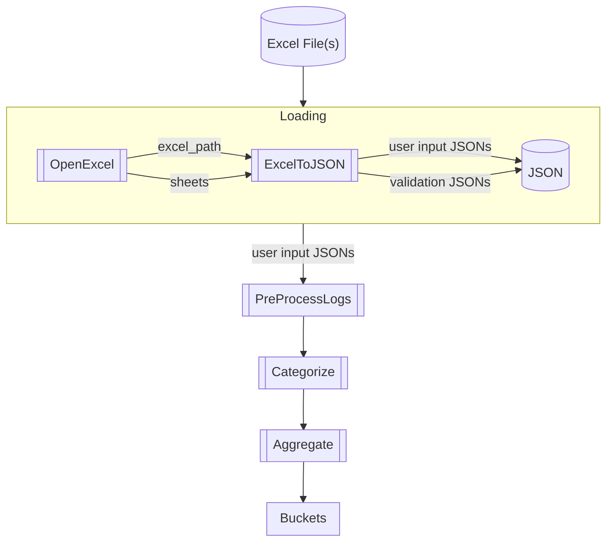

# Budget_Buckets
Budgeting tool that focuses on continuous operation rather than month-by-month discrete units

TODO: implement print redirect (either context handler or via Logger) and use when loading previous steps as part of validation

## Update Process
1. Download the new data and add to the Excel sheet Log tab(s)
2. Manually categorize transactions
3. Copy the categorizations to the Rules.csv
    - Log should now pass testing
4. Add row(s) to the Excel sheet Aggregate tab(s)
    - Aggregate should now pass testing
5. Add section(s) to the Excel sheet Buckets tab. Change date(s) and table name(s)
    - Buckets should now pass testing

## Details
BaseLib/CategoryList is the list of all possible categories (imported to various places)

Order of operations:
1. Loading - loads any external files and converts to a usable format. Makes configuration settings and JSON paths available to downstream processes.
2. PreProcessLogs - handle original/override/final Log logic
3. Categorize - categorize transactions
4. Aggregate - turn Logs into Aggregates
5. Buckets
    1. fetch Aggregates information for Buckets
    2. perform Bucket month logic

- Validation - testing and validation (duh)
    - `Excel --> JSON` pipeline is implicitly validated by git diff

